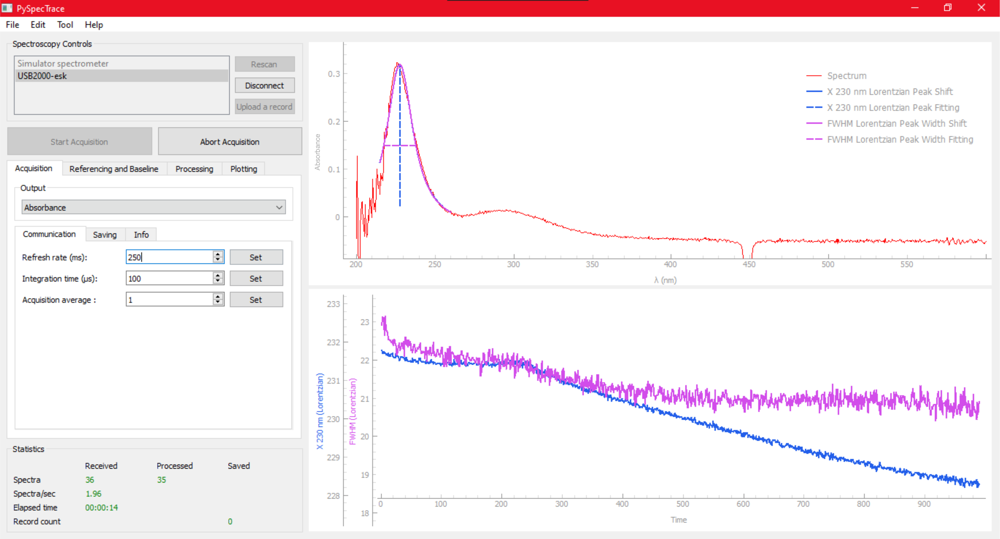

# PySpecTrace: Python-based Graphical User Interface (GUI) for Real-time UV-vis-NIR Spectroscopy Analysis

**PySpecTrace** is an open-source, Python-based graphical user interface (GUI) designed for real-time UV-visible spectroscopy data analysis. It addresses the limitations of proprietary spectrometer software by providing advanced, customizable, and real-time spectral tracking and analysis tools suitable for a wide range of scientific disciplines.

## How to Install and Run
- Detailed steps for installation and running documented in the Manual: [PySpecTrace_Manual.pdf](https://github.com/anamsigit/pyspectrace/blob/main/PySpecTrace_Manual.pdf)

## Extra Documentation
- **Repository:** [https://github.com/anamsigit/pyspectrace](https://github.com/anamsigit/pyspectrace)
- **Supporting information:** [PySpecTrace_SI.pdf](https://github.com/anamsigit/pyspectrace/blob/main/PySpecTrace_SI.pdf)
- **Demonstration video:** [Google drive](https://drive.google.com/file/d/1Tj6Fig017nFhzMavVcG9cRoBS5tbMKVn/view?usp=sharing)

## Key Features
- **Real-time spectral visualization:** Enables immediate monitoring of spectral changes during experiments.
- **Dynamic spectral tracing and peak tracking:** Utilizes adaptive fitting routines to identify and track spectral features live.
- **Flexible configuration:** User-friendly GUI includes panels for spectrometer connection, settings, data display, and analysis.
- **Spectral post-processing:** Offers robust data analysis capabilities for in-depth interpretation.
- **Spectrometer Simulator:** Supports testing without physical hardware, facilitating development and training.
- **Modular and adaptable:** Compatible with any spectrometer via appropriate driver interfaces; easily customizable for various experimental needs.

## Architecture
- Built on a **Model-View-Presenter (MVP)** pattern for maintainability and scalability.
- Uses popular Python libraries including **PyQt5, NumPy, SciPy, Pandas, Matplotlib, and PyqtGraph**.

## Motivation & Impact
Existing commercial solutions often limit analysis flexibility and are tied to specific hardware. PySpecTrace fills this gap by providing an open, versatile, and accessible tool that accelerates real-time decision-making in material science, chemistry, biology, and related fields.

## References
This project is inspired by prior works such as OceanOptics' OceanView, Insplorer software, and the authors’ previous development efforts.

## License
Apache License 2.0

---

*Sigit Khoirul Anam, Suwardi, Andrea Baldi, Ferry Anggoro Ardy Nugroho, Iwan Darmadi *
