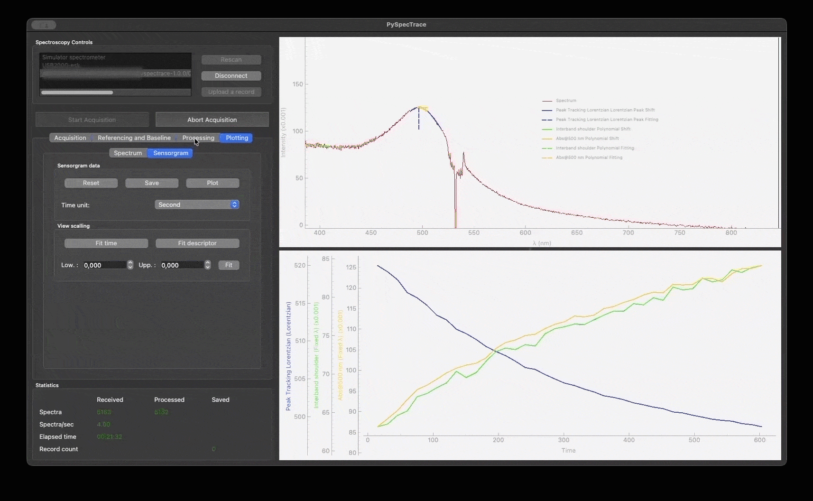

# PySpecTrace: Python-based Graphical User Interface (GUI) for Real-time UV-Vis-NIR Spectroscopy Analysis

**PySpecTrace** is an open-source, Python-based graphical user interface (GUI) designed for real-time UV-visible-NIR spectroscopy data analysis. It addresses the limitations of proprietary spectrometer software by providing advanced, customizable, and real-time spectral tracking and analysis tools suitable for a wide range of scientific disciplines.



## How to Install and Run
### Download the Code
- Go to the repository: [pyspectrace](https://github.com/anamsigit/pyspectrace)
- Click code then download ZIP
- Extract the ZIP file to your desired location

### Install Dependencies
Open a terminal or Command Prompt in the extracted project directory then run the following command:
```
pip install -r requirements.txt
```

### Run the Application 
After installation is complete, start the program with:
```
python main.py
```

### Spectrometer SDK Setup
To connect the software with supported spectrometers, you must manually provide the required SDK files (DLLs). These SDKs are proprietary and must be obtained directly from the hardware manufacturers. Place the SDK files in the following directories:
- Ocean Optics Spectrometer: ```Model/OceanSpectrometer/Oceandirect/lib```
- Avantes Spectrometer: ```Model/AvanterSpectrometer/SDK```
- CNI Laser Spectrometer: ```Model/CNILaserSpectrometer/SDK```

***Notes for Avantes Spectrometer***: If the spectrometer is still not detected after placing the SDK, please Install the official Avantes interface software from https://www.avantes.com/products/software/

> Detailed steps for running documented in the Manual: [PySpecTrace_Manual.pdf](https://github.com/anamsigit/pyspectrace/blob/main/PySpecTrace_Manual.pdf)

_If you encounter any issues or need assistance, we will do our best to help. Please feel free to contact us via the **Corresponding Contact**_


## Extra Documentation
- **Repository:** [https://github.com/anamsigit/pyspectrace](https://github.com/anamsigit/pyspectrace)
- **Supporting information:** [PySpecTrace_SI.pdf](https://github.com/anamsigit/pyspectrace/blob/main/PySpecTrace_SI.pdf)
- **Demonstration video:** [Google drive](https://drive.google.com/file/d/1Tj6Fig017nFhzMavVcG9cRoBS5tbMKVn/view?usp=sharing)

## Key Features
- **Real-time spectral visualization:** Enables immediate monitoring of spectral changes during experiments.
- **Dynamic spectral tracing and peak tracking:** Utilizes adaptive fitting routines to identify and track spectral features live.
- **Flexible configuration:** User-friendly GUI includes panels for spectrometer connection, settings, data display, and analysis.
- **Spectral post-processing:** Offers robust data analysis capabilities for in-depth interpretation.
- **Spectrometer Simulator:** Supports testing without physical hardware, facilitating development and training.
- **Modular and adaptable:** Compatible with any spectrometer via appropriate driver interfaces; easily customizable for various experimental needs.

## Architecture
- Built on a **Model-View-Presenter (MVP)** pattern for maintainability and scalability.
- Uses popular Python libraries including **PyQt5, NumPy, SciPy, Pandas, Matplotlib, and PyQtGraph**.
- This project has been tested with **Python 3.9.13**.

## List of working spectrometers
PySpecTrace v.1.0.0 has been tested and working seamlessly with these commercial spectrometers (on Windows OS):

## Supported Spectrometers

| Ocean Optics           | Avantes                      | CNI          |
|-----------------------|------------------------------|--------------|
| Maya PRO2000          | AvaSpec-ULS4096CL-EVO        | Aurora 4000  |
| HR 4000CG-UV-NIR      | AvaSpec-2048-USB2            |              |
| USB4000               |                              |              |

Please add to the list if you have found that it works in your spectrometer. It will be a nice information for new user.

## Corresponding contact
- Feel free to contact us via Iwan Darmadi (email:iwan.darmadi@alumni.ui.ac.id)


---

*Sigit Khoirul Anam, Suwardi, Andrea Baldi, Ferry Anggoro Ardy Nugroho, Iwan Darmadi*
